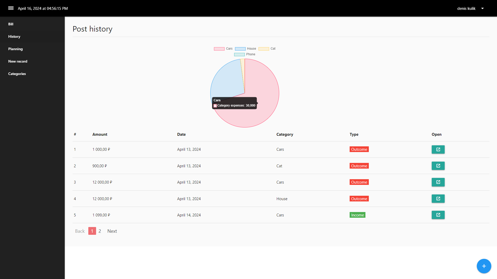

# crm-system


[Demo](https://deniskulik.github.io/crm-system/)

## Built With
This is a crm-system project built using `JavaScript`, `Vue`, `Vuex`, `Firebase`, `ChartJS`, `Vuelidate`, `Jest` and `Materialize CSS`.

## Screenshots



## Description
This is a personal finance management application that allows you to track your income and expenses. All information is presented in a table and graph. The application also has a built-in currency exchange rate API.

## Project setup
```
pnpm install
```

### Compiles and hot-reloads for development
```
pnpm run serve
```

### Compiles and minifies for production
```
pnpm run build
```

### Run your unit tests
```
pnpm run test:unit
```

### Lints and fixes files
```
pnpm run lint
```
